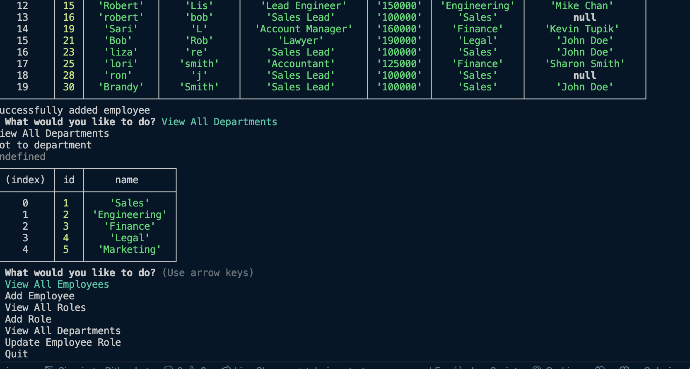

# Employee Tracker DB

## Table of Contents

- [Description](#description)
- [installation](#installation)
- [Usage](#usage)
- [License](#license)
- [Contributing](#contributing)
- [Tests](#tests)
- [Questions](#questions)

## Description

This is command-line application that allows to manage a company's employee database, using Node.js, Inquirer, Express, and MYSQL. This application allows to view all departments, all employees, all roles, add a role, and add an employee. The delete option was not added to the app.

## Installation

In order to use this app, one will need the use of Inquirer package as well as Express.

## Usage

The application accepts user's input.When the user starts the application, then the user is presented with the following options: view all department, viiew all roles, view all employees, add a department, add a role, add an employee, and update employee role.

## License

Licensed under the [MIT](http://choosealicense.com/licenses/mit/) license.

## Contributing

## Tests

## Questions

[The URL of the GitHub profile](https://github.com/LizaS2022).

The URL of the walkthrough video.
